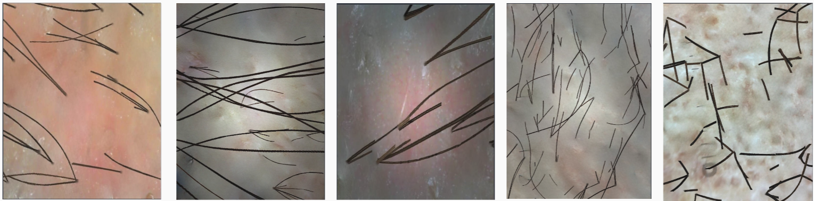

# Synthetic Trichoscopy Dataset for Per-Hair Instance Segmentation

A large-scale synthetic dataset of trichoscopy images with exact **per-hair instance segmentation masks**, generated by a scale-aware compositing pipeline that requires minimal manual annotation.

---

## What is in the dataset?

The dataset contains **20,000 synthetic trichoscopy images** together with their automatically derived per-hair instance segmentation labels in YOLO format.
Each label file encodes one polygon mask per individual hair shaft visible in the image.
All masks are geometrically exact — derived directly from the compositing transforms at generation time, so no manual labelling was performed at any stage.

| Property          | Value                                                 |
| ----------------- | ----------------------------------------------------- |
| Total images      | 20,000                                                |
| Train / Val split | 18,000 / 2,000 (90 % / 10 %)                          |
| Annotation format | YOLO instance segmentation (normalised polygon masks) |
| Classes           | 1:`hair_shaft`                                      |

---

## How the data was generated

The pipeline operates in three sequential stages.

### Stage 1: Hair-free scalp backgrounds

Starting from a collection of real trichoscopy images, a semantic hair-segmentation model and a follicle detector produce a combined hair-and-follicle mask for each image.
The masked region is dilated with a 9-pixel elliptical kernel and reconstructed by an inpainting model producing a realistic hair-free scalp background that preserves skin texture, follicular openings, and illumination.
Each background is assigned a **follicle diameter** $d_i$ (px) estimated from the follicle detector, which encodes the effective magnification of that image.

### Stage 2: Individual hair segment library

A targeted subset of 600 images was selectively annotated to extract clean, isolated individual hair shafts.
Annotators labelled only hairs that were fully contained within the image, free from motion blur, and sufficiently isolated for single-strand extraction, prioritising atypically thick, fine, or short strands to maximise diversity.
This produced a library of **~5,400 RGBA hair crops**, each stored with its root/tip endpoints, length, diameter, curvature, growth orientation, placement type, and source magnification $d_i^\text{src}$.

### Stage 3: Scale-aware compositing

For each synthetic image, a background and a set of hair segments are combined.
Each segment is resized by the factor

$$
s_{ij} = \frac{d_i^{\text{scalp}}}{d_j^{\text{seg}}} \cdot m
$$

where $d_i^{\text{scalp}} / d_j^{\text{seg}}$ corrects for the magnification difference between the target background and the segment source, and $m \sim \mathcal{U}(0.6, 1.4)$ simulates intra-scalp zoom variation.
Segments are geometrically augmented (horizontal flip, rotation aligned to the dominant growth direction) and photometrically augmented (luminance-mapped tinting across five colour palettes to reproduce hair colours from white to black).
A shared photometric degradation, radial vignetting, Gaussian blur, additive noise, JPEG re-encoding is applied to the whole image so that hair boundaries receive the same treatment as the surrounding scalp.
Because every placement is a fully recorded geometric transform, **per-hair binary instance masks are derived at zero additional cost**.

## Image-type statistics

Five generators reproduce distinct clinical presentations found in trichoscopy practice:

| Type              | Description                                                                     | Share  |
| ----------------- | ------------------------------------------------------------------------------- | ------ |
| Normal            | 1–3 hairs anchored per detected follicle with a small free-floating component  | 47.2 % |
| Floating dominant | 15–35 long shed hairs traversing the image edge-to-edge (diffuse alopecia)     | 35.0 % |
| Close-up stub     | Short proximal stubs at high magnification (zoom ×1.5–3.0)                    | 9.8 %  |
| Dual direction    | Two dominant growth directions separated by 45°–180° (crown / parting line)  | 5.2 %  |
| Radial fan        | Fully independent direction per hair — centrifugal starburst (alopecia areata) | 2.8 %  |

*Examples of each generator type (left to right): Normal, Floating dominant, Close-up stub, Dual direction, Radial fan.*

---

## File structure

synthetic_v3/
├── images/
│   
│           )
├── labels/ # YOLO instance segmentation labels (.txt)

Each `.txt` label file follows the YOLO instance segmentation format —
one line per hair instance: `0 x1 y1 x2 y2 ... xN yN` with all coordinates normalised to `[0, 1]`.

---
## Download

The dataset can be downloaded using the following link:

[Download SynTrich dataset](https://drive.google.com/file/d/1jJy0TSj40F5ZkstXLRbciJPlVrtycHyt/view?usp=sharing)

